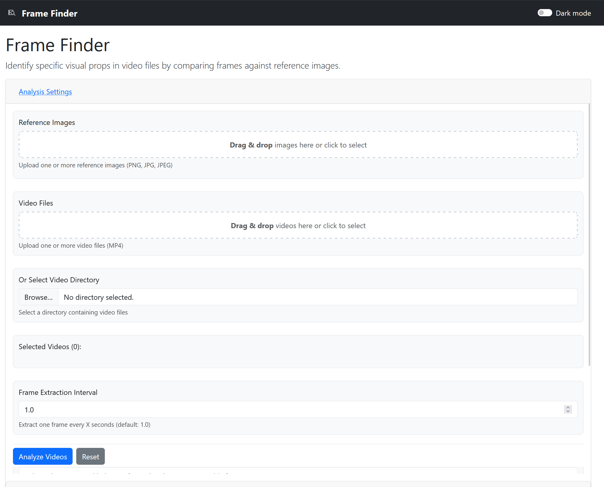

# Frame Finder

A lightweight Flask-based web tool that identifies specific visual props in video files by comparing frames against reference images using OpenCV feature matching + geometric verification.



## Overview

Frame Finder extracts frames from MP4 video files at regular intervals and compares them against reference images using ORB keypoints, BF matching with a ratio test, and RANSAC homography verification. This runs fully offline (with no required model downloads) and is tuned for high precision. While the initial use case is identifying the "Think Tank AI" prop from Star Trek: Voyager, the tool is designed to work with arbitrary inputs.

## Features

- Upload reference images (JPG/PNG) and video files (MP4)
- Drag-and-drop upload for references and videos
- Extract frames from videos at configurable intervals (supports decimal values)
- Compare frames against reference images using ORB feature matching + homography
- Efficient CPU-only processing; GPU not required
- Temporal clustering to reduce duplicate detections
- Adaptive thresholding per video for better accuracy
- Display results with timestamps, confidence scores, and thumbnails
- Real-time progress viewer during analysis
- Simple web interface for uploading and viewing results
- Optional export of results data

## Installation

1. Clone the repository:
   ```
   git clone <repository-url>
   cd frame-finder
   ```

2. Create a virtual environment:
   ```
   python3 -m venv venv
   source venv/bin/activate  # On Windows: venv\Scripts\activate
   ```

3. Install dependencies:
   ```
   pip install -r requirements.txt
   ```

4. Run the application:
   ```
   With the venv active:
   
   python app.py
   
   OR
   
   flask run
   ```

5. Open your browser to http://localhost:5000

## Usage

1. Navigate to the web interface
2. Upload one or more reference images (JPG/PNG)
3. Optionally drag-and-drop files into the upload areas
4. Upload one or more video files (MP4)
5. Adjust processing parameters as desired:
   - Frame Extraction Interval: The frequency of extracted frames for image analysis. Default is 1.0s.
   - Scanning Mode: Choose from Fast, Balanced, or Thorough scanning modes. Defaults to Balanced.
   - Top Images to Keep: Chose from 0-100 images to keep from each scanned video file. These top images are visible in the results page.
6. Click "Analyze" to start processing
7. View real-time progress during analysis
8. View results with timestamps, confidence scores, and thumbnails
9. Optionally export results

### Results Page:


- The results page lists all image matching results from the analysis engine, based on the input images and videos. 
- By default, each video sorts the results by confidence score. A global confidence score filter at the top of the page can be used to actively filter the contents of all videos to the specified threshold. 
- Each matching frame includes the Timestamp, Confidence Score, Reference Image, and a Preview image of that video frame. Only images that fall within the 'Top N' kept frames (as specified by the settings page, default 5) are preserved.
- Each Video card is collapsible
- Analysis results can be exported in `.json` format.


### Core Components

- **Flask**: Web framework for handling requests and rendering templates
- **OpenCV**: Video processing, ORB features, BF matching, homography
- **PIL/Pillow**: Image processing utilities

### Processing Workflow

1. User uploads reference images and video files (or drag-and-drop)
2. Reference keypoints/descriptors are computed once and cached
3. Videos are processed to extract frames at regular intervals (supports decimals)
4. Each frame is matched to references using BF+ratio test; RANSAC homography finds inliers
5. Per-frame confidence is computed from inlier count and inlier ratio
6. Temporal clustering reduces duplicate detections
7. Results are displayed with timestamps, confidence scores, and thumbnails

### GPU Acceleration

- Auto-detects CUDA via OpenCV: if a CUDA-enabled OpenCV is installed and a GPU is available, frame feature extraction uses `cv2.cuda_ORB_create` with device memory to accelerate processing.
- Fallback: If CUDA is unavailable, all processing runs on CPU with identical behavior.
- Override: Set `FRAME_FINDER_USE_CUDA=1` to force-enable when supported, or `FRAME_FINDER_USE_CUDA=0` to force CPU.
- Note: This path uses OpenCV’s CUDA modules; PyTorch is not required for GPU acceleration.

### Project Structure

```
frame-finder/
├── app.py                 # Flask app entry point
├── analyzer.py            # Core image/video processing logic
├── requirements.txt       # Python dependencies
├── templates/             # HTML templates
│   ├── base.html          # Base template
│   ├── index.html         # Main upload page
│   └── results.html       # Results display
├── static/                # Static assets
│   ├── css/               # Stylesheets
│   ├── js/                # JavaScript files
│   └── thumbnails/        # Generated thumbnails
└── README.md              # This file
```

### Adding New Features

The modular architecture allows for easy extension:

- Add new comparison algorithms in analyzer.py
- Extend UI features in templates/
- Add new routes in app.py

### Code Structure

- `app.py`: Main Flask application with routes
- `analyzer.py`: Core processing logic
- `templates/`: HTML templates using Jinja2
- `static/`: CSS, JavaScript, and other static assets

## Future Enhancements

- SQLite database for storing and querying results
- Support for additional video formats
- Advanced filtering and sorting of results
- Optional second-stage verifier (e.g., CLIP) when network/GPU available
- Micro-tuning around peaks

## License

## License
MIT © 2025 [DienerTech LLC](https://diener.tech)

## Acknowledgments
- OpenCV for computer vision primitives
- Flask for the web framework
