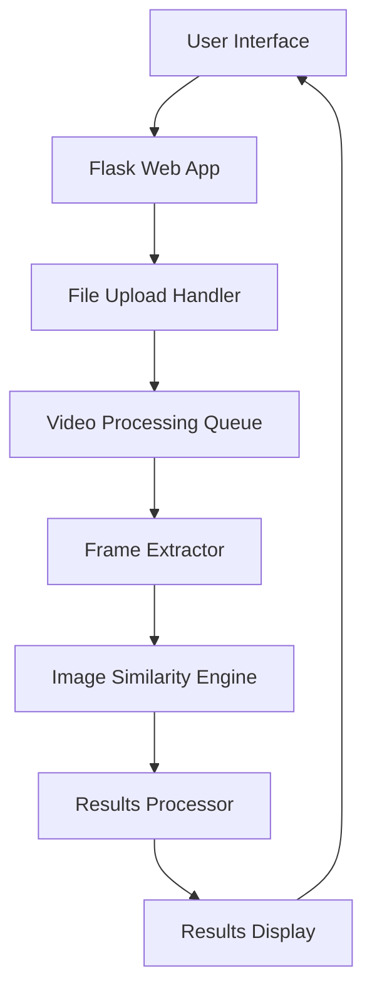
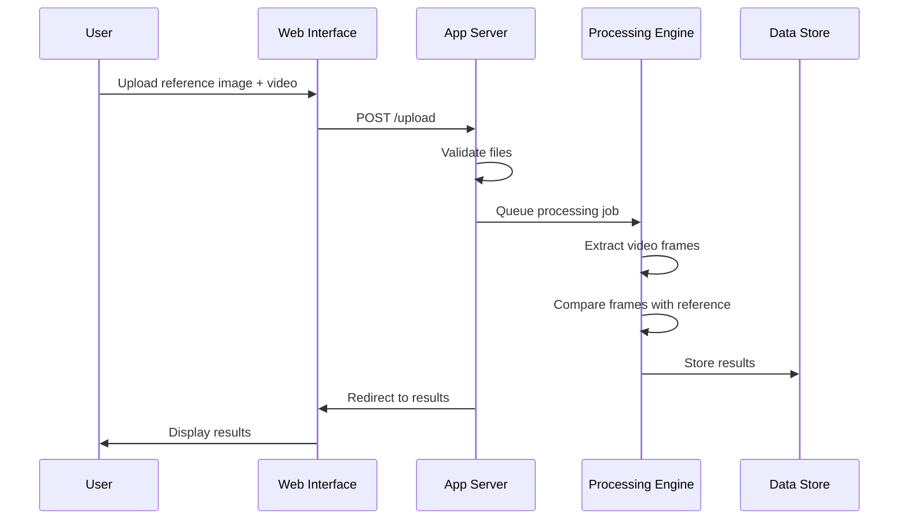

# Frame Finder - Implementation Plan

## System Architecture

## Component Details

### 1. Flask Web App (app.py)
The main entry point that handles:
- Serving web pages
- Receiving file uploads
- Managing processing workflow
- Displaying results

### 2. File Upload Handler
- Accepts reference images (JPG/PNG)
- Accepts video files (MP4) or directories
- Validates file types and sizes
- Stores files temporarily for processing

### 3. Video Processing Queue
- Manages processing order for multiple videos
- Handles progress tracking
- Manages resource allocation

### 4. Frame Extractor
- Uses OpenCV to read video files
- Extracts frames at configurable intervals (default: 1 frame/second)
- Converts frames to PIL Images for processing

### 5. Image Similarity Engine
- Uses CLIP model to generate embeddings
- Compares reference images with video frames
- Calculates similarity scores
- Returns matches above threshold

### 6. Results Processor
- Formats results with timestamps and confidence scores
- Generates thumbnails for matching frames
- Organizes results for display

### 7. Results Display
- Renders results in web UI
- Shows thumbnails, timestamps, and confidence scores
- Provides export functionality

## Data Flow

1. User uploads reference image(s) and video file(s)
2. System validates and stores files
3. For each video:
   - Extract frames at regular intervals
   - Compare each frame with reference images
   - Collect matches above confidence threshold
4. Process and format results
5. Display results with thumbnails
6. Provide export options

## API Endpoints

### GET /
- Renders main upload page

### POST /upload
- Handles file uploads
- Starts processing workflow
- Redirects to results page

### GET /results/<job_id>
- Displays processing results
- Shows progress if still processing

### GET /thumbnails/<filename>
- Serves generated thumbnails

## Processing Workflow

## Error Handling

- Invalid file types
- Processing failures
- Resource limitations
- Model loading errors

## Performance Considerations

- Frame extraction interval (balance accuracy vs. processing time)
- Batch processing for multiple videos
- Memory management for large videos
- Model loading optimization