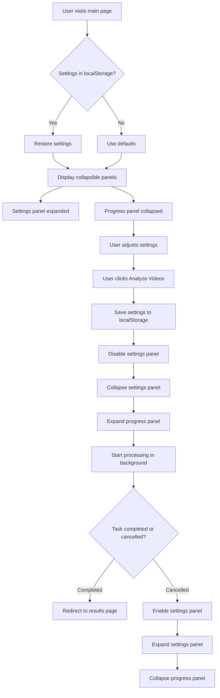
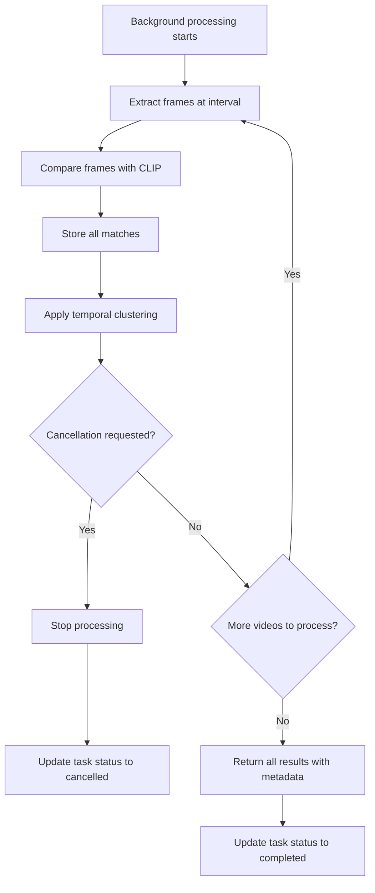
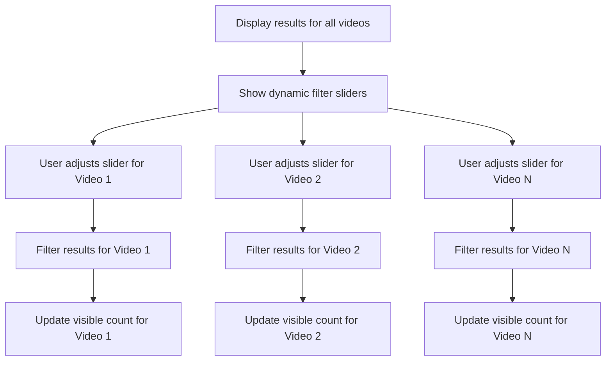

# Frame Finder Updated Workflow Diagrams

## Main Page Workflow with Collapsible Panels



## Analysis Process with Cancellation Support



## Results Page with Multi-Video Filtering



## Cancel Confirmation Flow

```mermaid
graph TD
    A[User clicks Cancel button] --> B[Show confirmation dialog]
    B --> C{User confirms cancellation?}
    C -->|Yes| D[Send cancel request to backend]
    D --> E[Update UI to cancelled state]
    E --> F[Enable settings panel]
    F --> G[Expand settings panel]
    G --> H[Collapse progress panel]
    
    C -->|No| I[Close confirmation dialog]
    I --> J[Continue processing]