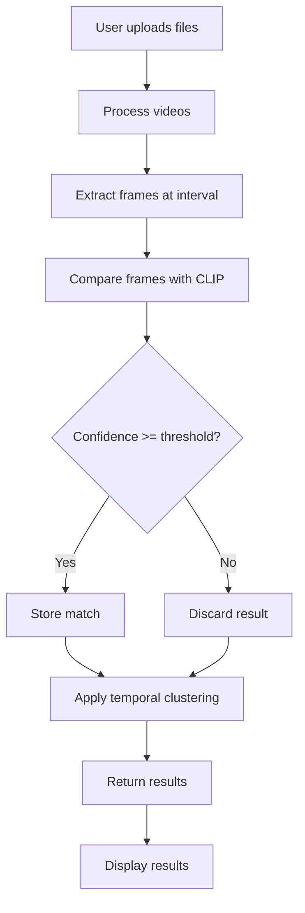
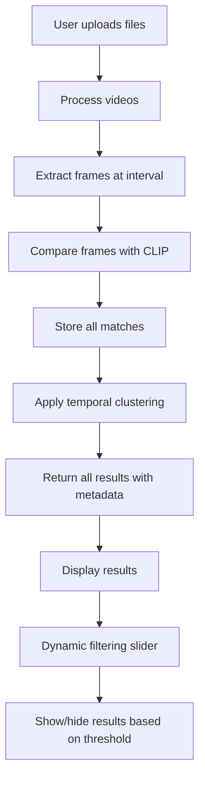
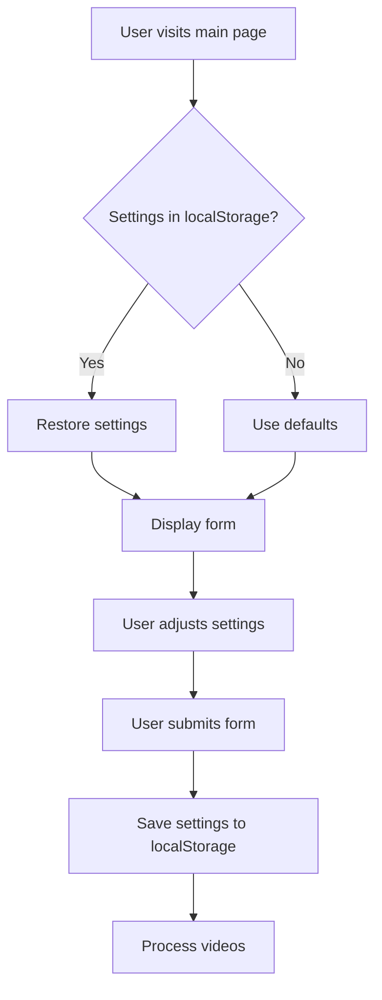

# Frame Finder Workflow Diagrams

## Current Workflow



## Proposed Workflow



## Settings Persistence Flow



## Time Display Flow

```mermaid
graph TD
    A[Backend returns timestamp in seconds] --> B[Template receives data]
    B --> C[JavaScript formats timestamp]
    C --> D[Display in hh:mm:ss format]